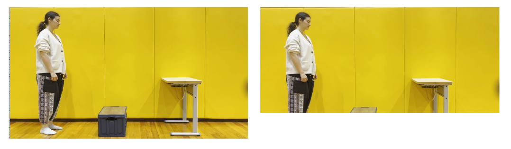

# Human Perceptual Weight Judgment Dataset


[[Project Report]](https://docs.google.com/document/d/e/2PACX-1vSASPeU8cQC7EI6yIh76JWRZKQWgrYbdHmD1CYblf8ZGva5pHf9cNvCmzJoQ0WjJg73TBcDSSHU6jVA/pub)
<p align="center">

</p>
This is a dataset for human perceptual weight judgment. 

## Contents
1. [Dataset Structure](#dataset-structure)
2. [License](#license)
3. [Citation](#citation)

## Dataset Structure
After unzip the dataset, you can find two subfolders: `original`, `cropped`. The summary of each folder is described below:
```
original: 
cropped: 
```

**dataset**: This folder provides the scans of our template objects. 
```
DATASET_PATH
|--origials
|----actor1.jpg
|--cropped
|----actor1.jpg
```

## Example usage
Here we describe some example usages of our dataset: 

### Generate contact labels

We provide sample code in `compute_contacts.py` to generate contact labels from SMPL and object registrations. Run with:
```
python compute_contacts.py -s BEHAVE_PATH/sequences/TARGET_SEQ 
```
It samples 10k points on the object surface and compute binary contact label, and the correspondence SMPL vertices for each point. The result is saved as an `npz` file in the same folder of object registration results. 

## License
Copyright (c) 2024, Toyohashi-University-Of-Technology

Please read carefully the following terms and conditions and any accompanying documentation before you download and/or use this software and associated documentation files (the "Software").

The authors hereby grant you a non-exclusive, non-transferable, free of charge right to copy, modify, merge, publish, distribute, and sublicense the Software for the sole purpose of performing non-commercial scientific research, non-commercial education, or non-commercial artistic projects.

Any other use, in particular any use for commercial purposes, is prohibited. This includes, without limitation, incorporation in a commercial product, use in a commercial service, or production of other artefacts for commercial purposes.

THE SOFTWARE IS PROVIDED "AS IS", WITHOUT WARRANTY OF ANY KIND, EXPRESS OR IMPLIED, INCLUDING BUT NOT LIMITED TO THE WARRANTIES OF MERCHANTABILITY, FITNESS FOR A PARTICULAR PURPOSE AND NONINFRINGEMENT. IN NO EVENT SHALL THE AUTHORS OR COPYRIGHT HOLDERS BE LIABLE FOR ANY CLAIM, DAMAGES OR OTHER LIABILITY, WHETHER IN AN ACTION OF CONTRACT, TORT OR OTHERWISE, ARISING FROM, OUT OF OR IN CONNECTION WITH THE SOFTWARE OR THE USE OR OTHER DEALINGS IN THE SOFTWARE.

You understand and agree that the authors are under no obligation to provide either maintenance services, update services, notices of latent defects, or corrections of defects with regard to the Software. The authors nevertheless reserve the right to update, modify, or discontinue the Software at any time.

The above copyright notice and this permission notice shall be included in all copies or substantial portions of the Software. You agree to **cite the Dataset for human perceptual weight judgment** data in documents and papers that report on research using this Software.

In case the images are used for publication or public presentations, you are required to <strong>blur all human faces</strong>.

## Citation
If you use our code or data, please cite:
```bibtex
@inproceedings{liftingbox2024,
  title={Dataset for human perceptual weight judgment},
  author={Georgopoulou, Artemis and Israelov, Shani and Izumi, Takerhiro and Manschein, Fabiano and Takagi, Yuya}
  year={2024}
}
```
